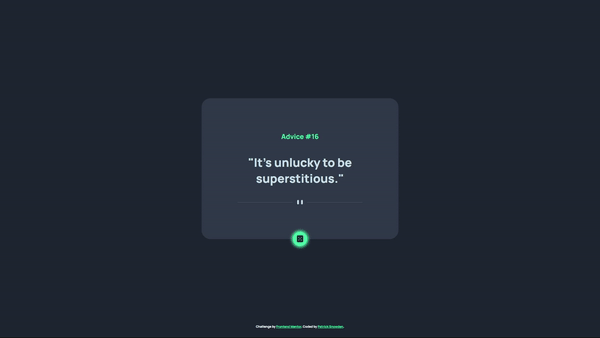

# Advice Generator App
Having a rough day? In this frontend mentor challenge, I made an application that uses the <a href="https://api.adviceslip.com/">Advice Slip API</a> to give the user a random piece of advice every time they presse the dice button.  

[Click here](https://snowsneakers.github.io/advice-generator/) to get some advice!

## How It's Made:

**Tech used:** HTML, CSS, JavaScript

The advice quotes and id number are pulled from the api and appened to the DOM using OOP.

## Lessons Learned:

I wanted to continue working with classes, properties, and methods to familiarize myself more with object oriented programming.

